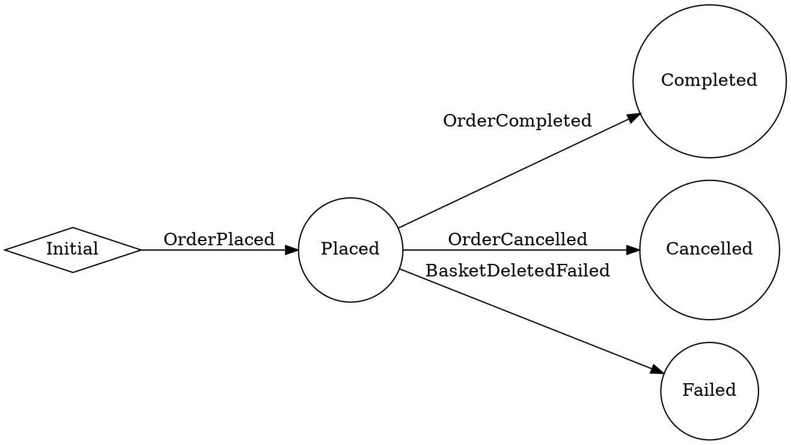

## Overview

This API endpoint provides access to the Order State Machine visualization, which is a core component of the Finance service following Domain-Driven Design principles. The endpoint returns a DOT format representation of the state machine that can be rendered into a visual graph.

The Order State Machine represents the lifecycle of an order as it moves through various states (Placed, Completed, Cancelled, Failed) in the Finance bounded context. It is implemented using MassTransit's state machine framework.

## Implementation Details

The endpoint is implemented using:

- **MediatR**: For handling the query via the CQRS pattern
- **MassTransit Visualizer**: For generating the state machine graph
- **Minimal API**: For exposing the HTTP endpoint

### Technical Flow

1. The endpoint receives a GET request at `/api/v1/order-state-machine`
2. The request is routed to the `GetOrderStateEndpoint` handler
3. The handler sends a `GetOrderStateQuery` via MediatR
4. The `GetOrderStateHandler` creates a new instance of `OrderStateMachine`
5. The handler uses `StateMachineGraphvizGenerator` to generate a DOT file representation
6. The DOT format string is returned to the client

## Security

This endpoint is secured with the Admin policy, requiring administrative privileges to access. This is enforced through the `.RequireAuthorization(Authorization.Policies.Admin)` directive.

## Use Cases

This endpoint is particularly useful for:

- **Debugging**: Visualizing the current state machine configuration
- **Documentation**: Generating up-to-date diagrams of the order workflow
- **Development**: Understanding the possible state transitions
- **Monitoring**: Verifying the correct configuration of the state machine

## Architecture

<NodeGraph />

## GET `(/api/v1/order-state-machine)`

### Example Usage

```bash
curl -X GET https://api.bookworm.com/api/v1/order-state-machine \
  -H "Authorization: Bearer <your-jwt-token>"
```

### Responses

#### <span className="text-green-500">200 OK</span>

The endpoint returns a plain text response containing the DOT format representation of the state machine graph. This can be used with Graphviz or similar tools to render a visual representation of the state machine.

<SchemaViewer file="response-200.json" maxHeight="500" id="response-200" />

### Example Response

