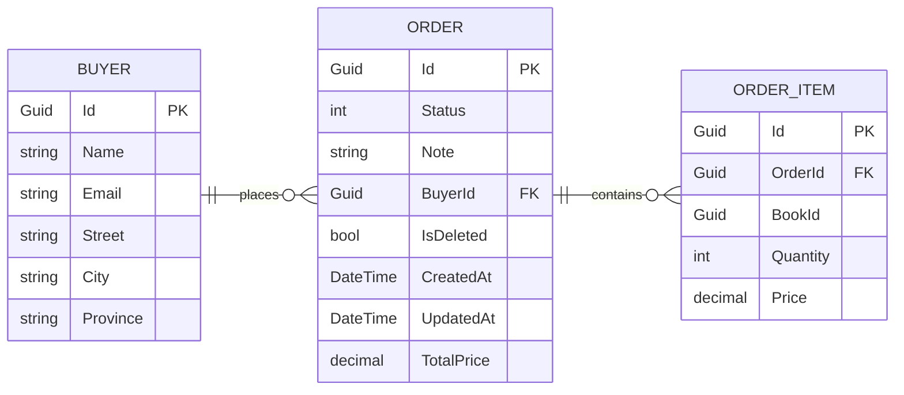
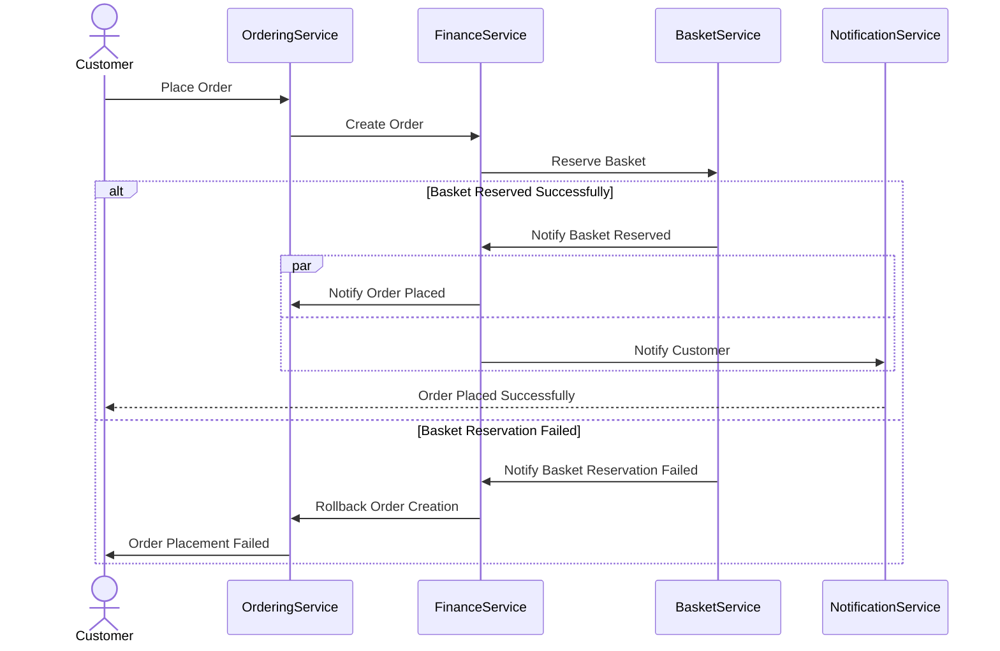

## Overview

The Ordering domain represents a strategic core domain within the BookWorm system, responsible for managing the complete lifecycle of customer orders from creation through fulfillment. As a core domain, it embodies critical business capabilities that directly impact the organization's competitive advantage.

<Tiles >
    <Tile icon="UserGroupIcon" href="/docs/users/nhanxnguyen" title="Contact the author" description="Any questions? Feel free to contact the owners" />
    <Tile icon="RectangleGroupIcon" href={`/visualiser/domains/${frontmatter.id}/${frontmatter.version}`} title={`${frontmatter.services.length} services are in this domain`} description="This service sends messages to downstream consumers" />
</Tiles>

### Domain Characteristics

- **Bounded Context**: The Ordering domain has a well-defined boundary with explicit integration points with other domains like Basket, Catalog, and Notification through domain events.

- **Event Sourcing**: The domain implements event sourcing as its persistence mechanism, storing the complete history of order-related events rather than just the current state. This approach provides a comprehensive audit trail and enables temporal queries and state reconstruction at any point in time.

- **Aggregates and Entities**:
  - **Order** (aggregate root) - Controls the consistency boundaries for order operations
  - **OrderItem** (entity) - Books and quantities associated with an order
  - **Buyer** (aggregate root) - Controls the consistency boundaries for buyer operations
  - **Address** (value object) - Immutable shipping details

### Entity Relational Diagram

#### <ins>Table: Order</ins>

| Column | Type | Description |
|--------|------|-------------|
| Id | Guid | The unique identifier for the order |
| Status | int | The status of the order |
| Note | string | The note for the order |
| BuyerId | Guid | The buyer id |
| IsDeleted | bool | Whether the order is deleted |
| CreatedAt | DateTime | The date and time the order was created |
| UpdatedAt | DateTime | The date and time the order was updated |
| TotalPrice | decimal | The total price of the order |

#### <ins>Table: OrderItem</ins>

| Column | Type | Description |
|--------|------|-------------|
| Id | Guid | The unique identifier for the order item |
| OrderId | Guid | The order id |
| BookId | Guid | The book id |
| Quantity | int | The quantity of the book |
| Price | decimal | The price of the book |

#### <ins>Table: Buyer</ins>

| Column | Type | Description |
|--------|------|-------------|
| Id | Guid | The unique identifier for the buyer |
| Name | string | The name of the buyer |
| Email | string | The email of the buyer |
| Street | string | The street of the buyer |
| City | string | The city of the buyer |
| Province | string | The province of the buyer |

:::info

Lists of order status:

- `New (0)`: Initial state when an order is first created
- `Cancelled (1)`: Order has been cancelled by the buyer or system
- `Completed (2)`: Order has been successfully fulfilled and delivered

:::

### Domain Events

The domain produces and consumes various events including:

- `OrderCancelledEvent`: Event raised when an order is cancelled
- `OrderCompletedEvent`: Event raised when an order is completed
- `OrderPlacedEvent`: Event raised when an order is placed

### Business Rules and Invariants

- Orders must contain at least one item to be submitted
- Order status transitions follow a predefined state machine (e.g., Placed -> Completed or Cancelled)
- Cancellation is only permitted before the "Shipped" status
- Price calculations and summaries are validated against business rules

The domain handles complex business scenarios like partial fulfillment, order modifications, and cancellations while maintaining consistency and enforcing business rules throughout the order lifecycle.

## Architecture diagram

<NodeGraph />

<MessageTable format="all" limit={4} />

## Ordering process (sequence diagram)

