<Tiles >
    <Tile icon="DocumentIcon" href={`/docs/services/${frontmatter.id}/${frontmatter.version}/changelog`}  title="View the changelog" description="Want to know the history of this service? View the change logs" />
    <Tile icon="UserGroupIcon" href="/docs/users/nhanxnguyen" title="Contact the author" description="Any questions? Feel free to contact the owners" />
    <Tile icon="BoltIcon" href={`/visualiser/services/${frontmatter.id}/${frontmatter.version}`} title={`Sends ${frontmatter.sends.length} messages`} description="This service sends messages to downstream consumers" />
    <Tile icon="BoltIcon"  href={`/visualiser/services/${frontmatter.id}/${frontmatter.version}`} title={`Receives ${frontmatter.receives.length} messages`} description="This service receives messages from other services" />
</Tiles>

## Overview

The Ordering Service is a core bounded context in the BookWorm ecosystem responsible for managing the complete order lifecycle. Implemented using Domain-Driven Design principles, this service encapsulates all business logic related to order processing, from creation to fulfillment or cancellation.

### Domain Model

The service is structured around the Order aggregate root, which enforces invariants and business rules across the entire ordering process. Key components include:

- **Order Aggregate**: Central entity that maintains order consistency and contains:

  - Order Items (entities)
  - Order Status (enumeration value object)

- **Buyer Aggregate**: Represents customer information with:
  - Personal Details (entity)
  - Default Address (value object)

### Patterns & Implementation

- **CQRS Pattern**: Separates command and query responsibilities
- **Repository Pattern**: Provides persistence abstraction for aggregates
- **Specification Pattern**: Encapsulates business rules for order validation
- **State Pattern**: Manages transitions between order statuses

### External Dependencies

The Ordering Service interacts with:

- **Basket Service**: Consumes basket data for order creation
- **Catalog Service**: Validates product availability
- **Notification Service**: Triggers customer notifications on status changes

## Core Features

| Feature                | Description                                                                 |
| ---------------------- | --------------------------------------------------------------------------- |
| **Create Order**       | Allows customers to create new orders with multiple items                   |
| **Update Order**       | Supports order status updates, including completion or cancellation         |
| **View Order**         | Provides detailed order information, including status and items             |
| **Manage Buyer**       | Enables customer profile management, including address and personal details |
| **Delete Buyer**       | Allows customers to remove their account and associated orders              |
| **View Buyer Profile** | Displays customer information and order history                             |

## Architecture diagram

<NodeGraph />

## Infrastructure

The Ordering Service is deployed as a set of microservices within the BookWorm ecosystem. It leverages cloud-native technologies and follows best practices for scalability, reliability, and performance.

```mermaid
architecture-beta
    group api(logos:microsoft-azure)[API]

    service db(logos:postgresql)[Database] in api
    service server(logos:docker-icon)[Server] in api
    service cache(logos:redis)[Idempotency Store] in api

    db:L -- R:server
    server:L -- R:cache
```

