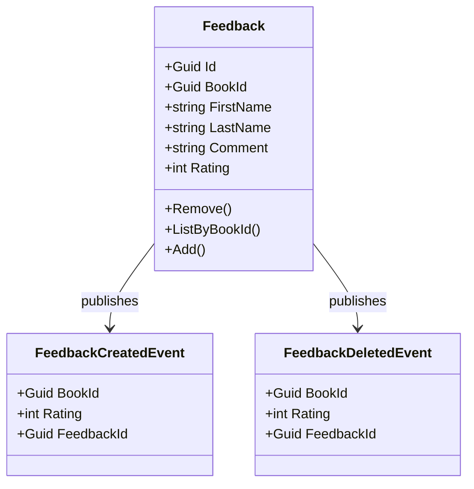

## Overview

The Rating domain is responsible for collecting and managing customer feedback for books in the BookWorm ecosystem. As a core domain, it implements Domain-Driven Design principles with a well-defined bounded context focused on the feedback lifecycle. This domain enables customers to share their experiences and ratings, helping other users make informed purchasing decisions.

<Tiles >
    <Tile icon="UserGroupIcon" href="/docs/users/nhanxnguyen" title="Contact the author" description="Any questions? Feel free to contact the owners" />
    <Tile icon="RectangleGroupIcon" href={`/visualiser/domains/${frontmatter.id}/${frontmatter.version}`} title={`${frontmatter.services.length} services are in this domain`} description="This service publishes domain events to other bounded contexts" />
</Tiles>

## Domain Model

### Aggregates

The Rating domain is centered around the `Feedback` aggregate root:

### Domain Events

The domain publishes events to notify other parts of the system about feedback changes:

- **FeedbackCreatedEvent**: Triggered when a new feedback is submitted
- **FeedbackDeletedEvent**: Triggered when a feedback is removed

### Value Objects

- **Rating**: An integer value between 0 and 5, representing the customer's satisfaction level

### Domain Rules

- Ratings must be between 0 and 5 stars
- Each feedback is associated with a specific book
- Feedback can include optional comments and customer information

## Strategic Design

### Bounded Context

The Rating domain maintains a clear boundary around feedback management, with well-defined interfaces to other domains:

- **Catalog Context**: Receives book rating updates to display on product pages
- **Customer Context**: Provides customer information for feedback attribution

### Context Mapping

- **Partnership** with Catalog domain: Bidirectional relationship where ratings affect book visibility and popularity
- **Customer-Supplier** with Identity domain: Consumes user information to associate with feedback

## Tactical Design

### Application Services

The domain implements CQRS pattern with distinct commands and queries:

- **Commands**:
  - CreateFeedbackCommand: Adds a new feedback for a book
  - DeleteFeedbackCommand: Removes an existing feedback

- **Queries**:
  - ListFeedbackQuery: Retrieves feedback for a specific book
  - GetAverageRatingQuery: Calculates the average rating for a book

### Repository Pattern

The `IFeedbackRepository` provides an abstraction over the persistence mechanism:

- AddAsync: Persists new feedback
- GetByIdAsync: Retrieves feedback by ID
- ListAsync: Retrieves feedback based on specifications
- CountAsync: Counts feedback matching specifications
- Delete: Removes feedback

## Integration Events

The domain publishes integration events to notify other bounded contexts:

- **FeedbackCreatedIntegrationEvent**: Notifies the Catalog service about new ratings
- **FeedbackDeletedIntegrationEvent**: Notifies the Catalog service about removed ratings

## Architecture diagram

<NodeGraph />

<MessageTable format="all" limit={4} />

## Technical Implementation

The Rating domain is implemented using:

- **Aggregate Pattern**: Encapsulates business rules and invariants
- **Domain Events**: For internal communication within the bounded context
- **Integration Events**: For cross-bounded context communication
- **CQRS**: Separating read and write operations
- **Specification Pattern**: For flexible query composition
