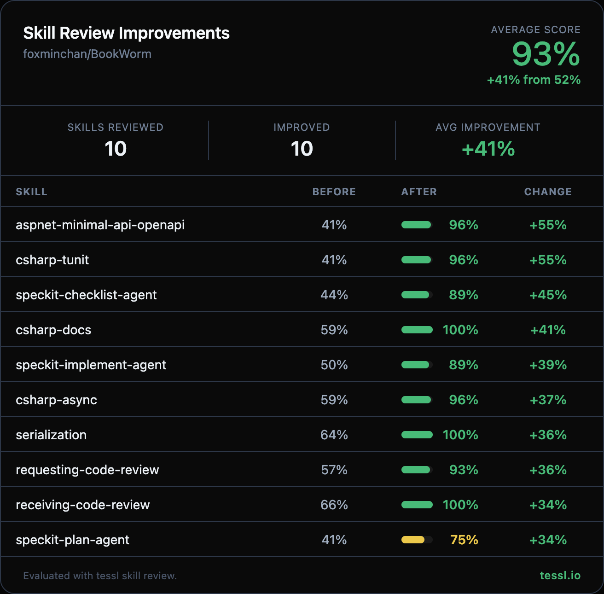

## Proposed changes

Hey @foxminchan 👋

I ran your skills through `tessl skill review` at work and found some targeted improvements. Here's the full before/after:

| Skill | Before | After | Change |
|-------|--------|-------|--------|
| aspnet-minimal-api-openapi | 41% | 96% | +55% |
| csharp-tunit | 41% | 96% | +55% |
| speckit-checklist-agent | 44% | 89% | +45% |
| csharp-docs | 59% | 100% | +41% |
| speckit-implement-agent | 50% | 89% | +39% |
| csharp-async | 59% | 96% | +37% |
| serialization | 64% | 100% | +36% |
| requesting-code-review | 57% | 93% | +36% |
| receiving-code-review | 66% | 100% | +34% |
| speckit-plan-agent | 41% | 75% | +34% |
| speckit-constitution-agent | 47% | 81% | +34% |
| speckit-specify-agent | 55% | 89% | +34% |
| speckit-tasks-agent | 55% | 89% | +34% |
| speckit-analyze-agent | 60% | 89% | +29% |
| speckit-taskstoissues-agent | 53% | 79% | +26% |
| mjml-email-templates | 66% | 89% | +23% |
| microsoft-extensions-configuration | 75% | 93% | +18% |
| csharp-type-design-performance | 84% | 100% | +16% |
| web-design-guidelines | 77% | 91% | +14% |
| vercel-react-best-practices | 77% | 91% | +14% |
| speckit-clarify-agent | 73% | 81% | +8% |
| aspire | 94% | 100% | +6% |
| book-catalog | 95% | 100% | +5% |
| store-policies | 89% | 94% | +5% |
| playwright-bdd-configuration | 69% | 74% | +5% |
| turborepo | 86% | 86% | +0% |

**Note:** The 9 speckit `*.agent` skills originally scored 0% because the `.` in their name field (e.g. `speckit-analyze.agent`) failed kebab-case validation. I fixed the names to use hyphens (e.g. `speckit-analyze-agent`) and re-scored to get the "before" baselines shown above. The actual improvement from 0% → after% is even larger, but the table reflects the corrected baselines to be more honest about the content-level improvements.

Changes summary

### Description improvements (all 26 skills)
- Added explicit `"Use when..."` trigger clauses to skills missing them
- Expanded natural trigger terms (e.g. added "REST API", "Swagger", ".NET API" to `aspnet-minimal-api-openapi`)
- Listed specific concrete actions in descriptions (e.g. what the skill does, not just what domain it covers)
- Converted multi-line YAML block scalar descriptions to quoted strings for consistency
- Fixed speckit skill names from dot notation (`.agent`) to kebab-case (`-agent`)

### Content improvements
- Added executable, copy-paste ready code examples to `aspnet-minimal-api-openapi`, `csharp-tunit`, `csharp-async`, `csharp-docs`
- Added validation checkpoints to workflows in `aspire`, `csharp-tunit`, `csharp-async`, `csharp-docs`, `aspnet-minimal-api-openapi`
- Removed unnecessary explanatory sections ("Why MJML?", "Why TUnit over xUnit?", generic "Best Practices")
- Removed duplicated "When to Use This Skill" sections that repeated the description
- Added concrete WebFetch tool call example and error handling to `web-design-guidelines`
- Added inline code examples and workflow prioritization to `vercel-react-best-practices`
- Consolidated redundant anti-pattern examples in `turborepo`
- Added validation workflow with placeholder checking to `mjml-email-templates`
- Moved `user-invocable` unknown frontmatter keys to proper `metadata` blocks
- Replaced philosophical descriptions with concrete action lists in `receiving-code-review` and `requesting-code-review`

Honest disclosure — I work at @tesslio where we build tooling around skills like these. Not a pitch - just saw room for improvement and wanted to contribute.

Want to self-improve your skills? Just point your agent (Claude Code, Codex, etc.) at [this Tessl guide](https://docs.tessl.io/evaluate/optimize-a-skill-using-best-practices) and ask it to optimize your skill. Ping me - [@rohan-tessl](https://github.com/rohan-tessl) - if you hit any snags.

Thanks in advance 🙏

## Types of changes

- [ ] 🐛 Bug fix
- [ ] ✨ Feature
- [x] 💥 Breaking change
- [x] 📝 Docs
- [x] ♻️ Refactor

## Checklist

- [x] Code compiles correctly
- [x] All tests passing
- [x] Follows DDD principles
- [x] Service boundaries maintained
- [x] C# 14 & `.editorconfig` followed
