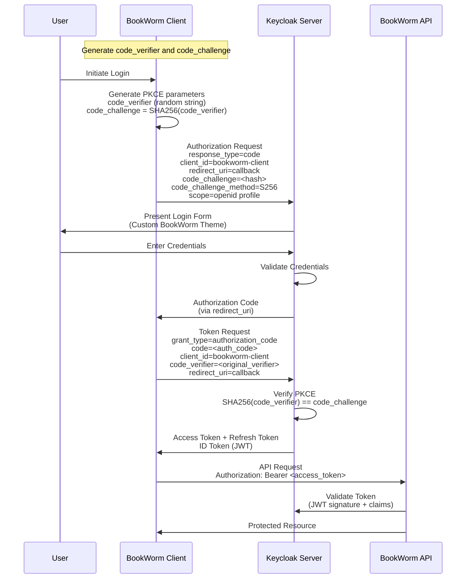

# Keycloak Identity and Access Management

## Overview

Keycloak is an open-source Identity and Access Management (IAM) solution that provides authentication and authorization
services for the BookWorm application. It serves as the central identity provider, handling user authentication, token
management, and access control across all BookWorm microservices.

### Purpose in BookWorm Application

In the BookWorm e-commerce platform, Keycloak serves several critical functions:

- **Centralized Authentication**: Single sign-on (SSO) across all BookWorm services
- **User Management**: Registration, login, profile management, and password policies
- **API Protection**: Securing REST APIs with JWT tokens and OAuth2 flows
- **Role-Based Access Control**: Managing permissions for different user types (customers, admins, etc.)
- **Client Management**: Supporting multiple client applications (web app, mobile app, APIs)
- **Custom Branding**: Providing a branded login experience with the BookWorm theme

## Authorization Code + PKCE Flow

The BookWorm application implements the OAuth2 Authorization Code flow with PKCE (Proof Key for Code Exchange) for
secure authentication. This flow is particularly important for public clients like SPAs and mobile applications.



### PKCE Security Benefits

- **Prevents Authorization Code Interception**: Even if the authorization code is intercepted, it cannot be exchanged
  for tokens without the original `code_verifier`
- **No Client Secret Required**: Perfect for public clients that cannot securely store secrets
- **Dynamic Challenge**: Each authentication flow uses a unique code challenge/verifier pair

## Folder Structure

```
src/Aspire/BookWorm.AppHost/Container/keycloak/
├── README.md                          # This documentation file
├── realms/
│   └── BookWormRealms.json            # Realm configuration with clients and settings
└── themes/
    └── BookWormThemes.jar             # Custom BookWorm login theme

Related Configuration Files:
├── BookWorm.AppHost/
│   └── Extensions/
│       └── KeycloakExtensions.cs      # Aspire Keycloak resource setup
└── BookWorm.ServiceDefaults/
    ├── Auth/
    │   └── AuthenticationExtensions.cs # JWT Bearer authentication setup
    ├── Keycloak/
    │   └── KeycloakUrls.cs            # URL generation service
    └── ApiSpecification/OpenApi/
        └── OpenApiOptionsExtensions.cs # OAuth2 documentation integration
```

### File Descriptions

- **`BookWormRealms.json`**: Complete realm configuration including:

    - Client definitions (public and confidential clients)
    - PKCE settings (`pkce.code.challenge.method": "S256"`)
    - Custom theme configuration (`"loginTheme": "bookworm"`)
    - Role mappings and user federation settings

- **`BookWormThemes.jar`**: Custom theme package containing:

    - Branded login pages
    - CSS styling matching BookWorm design
    - Custom templates and resources

- **`KeycloakExtensions.cs`**: Aspire integration that:
    - Sets up Keycloak container with proper configuration
    - Mounts realm and theme files
    - Configures environment variables

## Custom Theme Introduction

The BookWorm application includes a custom Keycloak theme to provide a branded authentication experience that matches
the application's design language.


### Theme Features

- **Custom UI**: Tailored login and registration forms using [Keycloakify](https://www.keycloakify.dev/)
- **Responsive Design**: Mobile-friendly login forms
- **Consistent UX**: Matches the main application's look and feel
- **Professional Appearance**: Enhanced user trust and brand recognition

### Theme Configuration

The custom theme is configured in the realm settings:

```json
{
  "loginTheme": "bookworm",
  "accountTheme": "bookworm",
  "adminConsoleTheme": "keycloak"
}
```

### Theme Deployment

1. **JAR Package**: The theme is packaged as `BookWormThemes.jar`
2. **Container Mount**: Mounted to `/opt/keycloak/providers/` in the Keycloak container
3. **Automatic Loading**: Keycloak automatically loads themes from the providers directory
4. **Realm Assignment**: The theme is assigned to the BookWorm realm via configuration

### Customization Areas

The BookWorm theme customizes several Keycloak pages:

- **Login Page**: Main authentication form
- **Registration**: User signup form
- **Password Reset**: Forgot password flow
- **Error Pages**: Branded error messaging
- **Email Templates**: Consistent email styling

### Development Notes

- Theme files are pre-built and packaged in the JAR
- Changes to the theme require rebuilding the JAR file
- The theme follows Keycloak's theme structure and templating system
- CSS and JavaScript customizations are included for enhanced UX
